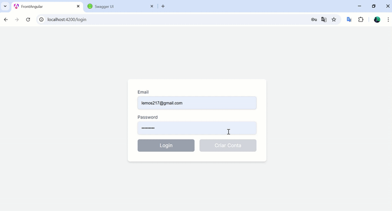

# Angular 17 .NET CQRS Project

Este projeto é uma aplicação baseada em Angular  e .NET utilizando o padrão CQRS (Command Query Responsibility Segregation). Ele foi desenvolvido para demonstrar a separação de responsabilidades entre comandos (escrita) e consultas (leitura), promovendo escalabilidade e organização no código.

## Funcionalidades
- Autenticação e autorização de usuários.
- Gerenciamento de vendas e produtos.
- Integração com banco de dados utilizando Entity Framework.
- Interface moderna e responsiva com Angular.
- Implementação de health checks para monitoramento.

## Tecnologias Utilizadas
- **Frontend:** Angular 
- **Backend:** .NET Core com CQRS
- **Banco de Dados:** PostgreSQL
- **Outras:** AutoMapper, MediatR, FluentValidation, TailwindCSS

## Demonstração



Para assistir à demonstração completa, acesse o vídeo localizado em:  
`demonstracoes/Mídia1.mp4`

## Como Rodar o Docker Compose Override

1. Certifique-se de que o Docker está instalado e em execução na sua máquina.
2. Navegue até o diretório raiz do projeto onde o arquivo `docker-compose.override.yml` está localizado.
3. Execute o seguinte comando para iniciar os serviços definidos no arquivo `docker-compose.override.yml`:
   ```bash
   docker-compose -f docker-compose.override.yml up --build
   ```
4. Aguarde até que todos os containers sejam iniciados. Você verá logs indicando que os serviços estão em execução.
5. Acesse os serviços:
   - **Frontend Angular:** [http://localhost:4200](http://localhost:4200)
   - **Backend API:** [http://localhost:8080](http://localhost:8080)
   - **Banco de Dados PostgreSQL:** Porta `5432`

6. Para parar os containers, utilize o comando:
   ```bash
   docker-compose -f docker-compose.override.yml down
   ```
## Configuração do Banco de Dados

Para configurar o banco de dados de forma automática, você pode utilizar o script `run-database-setup.bat` localizado no diretório raiz do projeto.

### Como Executar o Script
1. Navegue até o diretório raiz do projeto no terminal ou explorador de arquivos.
2. Execute o arquivo `run-database-setup.bat` com um duplo clique.
   
3. O script irá configurar o banco de dados PostgreSQL e aplicar as migrações necessárias automaticamente.

### Observação
Certifique-se de que o Docker está em execução antes de rodar o script, pois ele depende dos containers configurados no `docker-compose.override.yml`.
